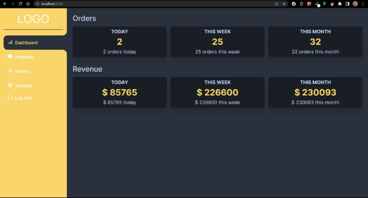
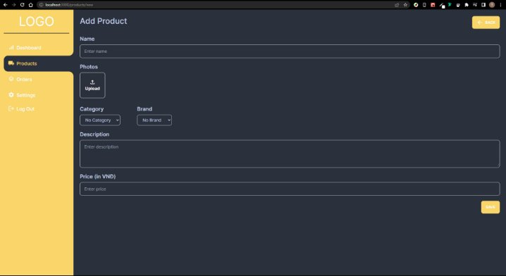
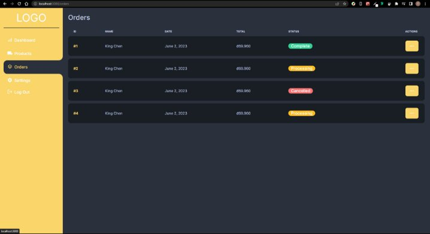
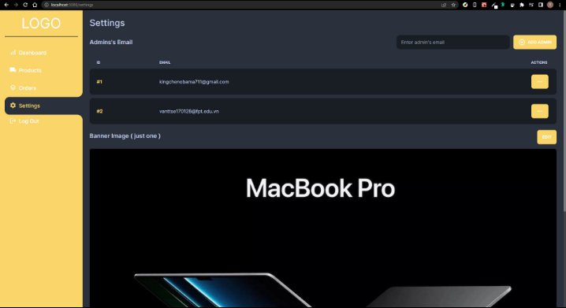

**TOL GEAR PROJECT**

Member:

- Trần Trương Văn ( Leader ) 
- Mai Thị Minh Thương 
- Võ Nhật Trường Duy

**1. Requirements**: 

**Name of the system:** 

TOL Gear

**Purpose**: 

TOL Gear consists of two websites: TOL Store and TOL Admin. The TOL Store is an e-commerce platform for selling various types of technology device. The TOL Admin is a management system used by administrators to handle products, orders, admin accounts, and revenue.

**Users of the system:**

\- TOL Store: Customers who visit the e-commerce store to browse and purchase technology products.

\- TOL Admin: Administrators responsible for managing the TOL Store's products, orders, and overall operations.

**Features of the system (classified by user type):**

- For Customers (TOL Store):

\+ User registration and login: Customers can create an account and log in to the TOL Store.

\+ Product browsing and selection: Customers can view various technology products and add them to their cart. Products can be classified by Category (Ex: Laptop, PC, keyboard, ......) or Brand (Ex: Asus, Akko, Razor, .......).

\+ Order placement: Customers can proceed to checkout and place an order.

\+ Order management: Customers can update the status of their orders by clicking the "Has Received" button to mark it as "Complete" or the "Cancel" button to cancel the order.

- For Administrators (TOL Admin):

\+ Admin login: Only administrators with specific email credentials can log in to the TOL Admin system.

\+ Revenue tracking: Administrators can view the revenue generated by the store.

\+ Product management: Administrators can view product details, edit, or delete products available in the TOL Store.

\+ Order management: Administrators can view and delete customer orders.

\+ Admin account management: Administrators can add and exclude email accounts for accessing the TOL Admin system.

\+ Banner image customization: Administrators can change the banner image displayed on the TOL Store.

\+ Warehouse management: manage the number of products in stock. When the product is out of stock, the product is no longer in stock.

**Technology stack:**

\- TOL Store (http://localhost:8080/store): is an application where regular HTML, CSS, and JavaScript are employed for frontend development, while Java Servlets serve as the backend infrastructure.

\- TOL Admin (http://localhost:3000): The client-side will be developed using Next.js/React.js, and the server-side will utilize Java Servlets to create an API (http://localhost:8080/store/api) for interacting with the TOLGear database.

**2. Wireframe or screenshots of the system** 

**TOL store:**

- **Header**

- **Footer**

- **http://localhost:8080/store/ (Home Page)** 

- **http://localhost:8080/store/product?id=....... (Product Detail Page)**

- **http://localhost:8080/store/orders**

- **http://localhost:8080/store/login**

- **http://localhost:8080/store/register**

**TOL admin:**

- **No token login, screen will always be login screen, no matter what path url**

- **http://localhost:3000**

- **http://localhost:3000/products**

- **http://localhost:3000/products/add**

- **http://localhost:3000/products/edit (same with …/products/add, but already have the data of edited product )**

- **http://localhost:3000/orders**

- **http://localhost:3000/settings**

