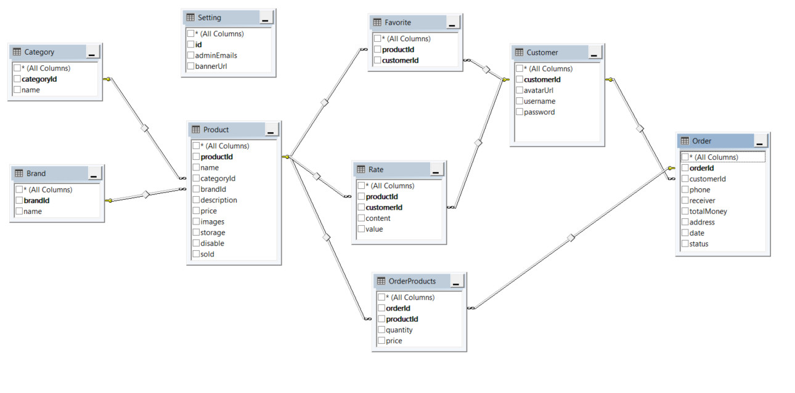

# TOL GEAR PROJECT

**Member:**
- Trần Trương Văn (Leader)
- Mai Thị Minh Thương
- Võ Nhật Trường Duy

## 1. Requirements

**Name of the system:** TOL Gear

**Purpose:**
TOL Gear consists of two interfaces: TOL Store and TOL Admin. The TOL Store is an e-commerce platform for selling various types of technology devices. The TOL Admin is a management system used by administrators to handle products, orders, admin accounts, and statistics.

**Users of the system:**
- TOL Store: Customers who visit the store interface to browse and purchase products.
- TOL Admin: Administrators responsible for managing the TOL Store's products, orders, and overall operations.

**Features of the system (classified by user type):**
- For Customers (TOL Store):
  - User registration and login: Customers can create an account and log in to the TOL Store.
  - Product browsing and selection: Customers can view various technology products and add them to their cart. Products can be classified by Category (Ex: Laptop, PC, keyboard, ...) or Brand (Ex: Asus, Akko, Razor, ...).
  - Order placement: Customers can proceed to checkout and place an order.
  - Order management: Customers can update the status of their orders by clicking the "Has Received" button to mark it as "Complete" or the "Cancel" button to cancel the order.

- For Administrators (TOL Admin):
  - Admin login: Only administrators with specific email credentials can log in to the TOL Admin system.
  - Revenue tracking: Administrators can view the revenue generated by the store.
  - Product management: Administrators can view product details, edit, or delete products available in the TOL Store.
  - Order management: Administrators can view and delete customer orders.
  - Admin account management: Administrators can add and exclude email accounts for accessing the TOL Admin system.
  - Banner image customization: Administrators can change the banner image displayed on the TOL Store.
  - Warehouse management: Manage the number of products in stock. When the product is out of stock, the product is no longer in stock.

**Technology stack:**
- TOL Store (http://localhost:8080/store): is an application where regular HTML, CSS, and JavaScript are employed for frontend development, while Java Servlets serve as the backend infrastructure.
- TOL Admin (http://localhost:3000): The client-side will be developed using Next.js/React.js, and the server-side will utilize Java Servlets to create an API (http://localhost:8080/store/api) for interacting with the TOLGear database.

## 2. Wireframe or screenshots of the system

**TOL store:**
- **Header**
  

- **Footer**
  

- **Home Page (http://localhost:8080/store/)**

- **Product Detail Page (http://localhost:8080/store/product?id=.......)**

- **Orders Page (http://localhost:8080/store/orders)**

- **Login Page (http://localhost:8080/store/login)**

- **Register Page (http://localhost:8080/store/register)**

**TOL admin:**
- **Login Page (if not log in yet)**
  

- **DashBoard Page (http://localhost:3000)**
  

- **Products Page (http://localhost:3000/products)**

- **Add Product Page (http://localhost:3000/products/add)**

- **Edit Product Page (http://localhost:3000/products/edit)**

- **Orders Page (http://localhost:3000/orders)**

- **Settings Page (http://localhost:3000/settings)**

## 3. Database Design

## 4. System Design

### 1. Frontend Design
#### Store Interface:
The store interface is server-side rendered (SSR) by the backend Java Servlet. It follows a traditional approach using HTML, CSS, and JavaScript to create a responsive and user-friendly user interface. The frontend is designed to provide an intuitive and smooth shopping experience for customers. The frontend leverages modern styling libraries like Tailwind CSS to enhance the visual appeal and streamline the design process.

#### Admin Interface:
The admin interface, on the other hand, is built using Next.js and Tailwind CSS. Unlike the store interface, the admin interface is not server-side rendered. Instead, it relies on APIs provided by the backend to fetch data and perform administrative tasks. The frontend and backend are decoupled in this case, allowing for more flexibility and ease of development in managing administrative functionalities.

### 2. UI/UX Design
The store interface is designed with a focus on usability and inspiration from various websites, including vaituhay.com, gearvn.com, and shopee.vn, to create an intuitive storefront for the users. The admin interface is influenced by design patterns found on dribbble.com to ensure a modern and aesthetically pleasing look.

### 3. Back-end Design
The backend is structured to handle both the store interface and the admin interface separately. It consists of the following components and modules:

#### For Store Interface:
- Controllers to manage store navigation and handle customer requests for product information, search, and other store-related functionalities.

#### For Admin Interface:
- APIs that provide data and functionality for administrative tasks such as managing products, orders, banners, and statistics.
- The backend serves as the single source of truth for the admin interface, ensuring data consistency and security.

### 4. User Authentication and Authorization
#### Store Interface:
The store interface allows users to register and log in using both regular credentials and Google authentication. Passwords are securely encrypted for normal login, while Google authentication relies on tokens obtained from Google APIs and validated on the server side.

#### Admin Interface:
Only Google authentication is permitted for administrators accessing the admin interface. The database maintains a list of valid administrator email addresses in a table called "Setting." Access to the admin interface is granted based on successful authentication with Google. When an admin attempts to log in, the admin client sends an API request to authenticate with Google and retrieve the admin's email. The backend then verifies the received email against the list of valid admin email addresses stored in the "Setting" table. If the email matches a valid admin, access is granted to the admin interface.

### 5. Third-Party Integrations
The application integrates the following third-party services and APIs to enhance functionality:
- Google APIs for user authentication.
- Firebase storage for storing product images and banners of the store interface.
